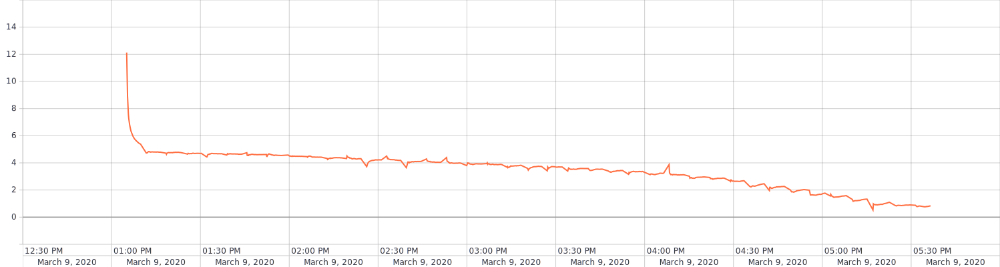
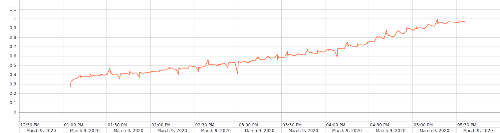
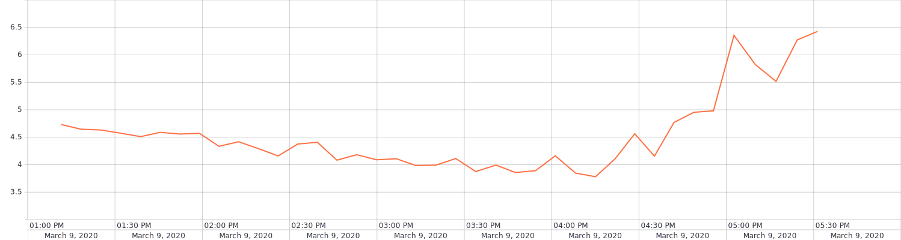

# HSE training project (VOC)

Neural Network model for multi-classification. Deep learning engine - PyTorch

## ResNet18
### Version 1
Dataset without augmentation and normalization 

|    Hyperparameter   |  Values |
|:-------------------:|:-------:|
| Image Size          | 300x300 |
| Batch size          | 16      |
| Accumulate gradient | 1       |
| Epochs              | 40      |
| Optimizer           | SGD     |
| Momentum            | 0.9     |
| Learning rate       | 5e-3    |

Train loss: 

Train ap: 

Valid loss: 

Valid ap: 

