# HSE training project (VOC)

Neural Network model for multi-classification. Deep learning engine - PyTorch 

## Results
|    Model version                   | Loss (Train) | Average precision (Train) | Loss (Valid) | Average precision (Valid) |
|:----------------------------------:|:------------:|:-------------------------:|:------------:|:-------------------------:|
| [ResNet18 version 1](#resnet18_v1) | 3.1240       | 0.6809                    | 3.7812       | 0.5852                    |
| [ResNet18 version 2](#resnet18_v2) | 3.1612       | 0.6795                    | 3.4894       | 0.6322                    |
| [ResNet18 version 3](#resnet18_v3) | 2.6351       | 0.7615                    | 3.5190       | 0.6551                    |

## ResNet18
### Version 1  
Dataset without augmentation and normalization 
An unprepared model was used 

|    Hyperparameter   |  Values |
|:-------------------:|:-------:|
| Image Size          | 300x300 |
| Batch size          | 16      |
| Accumulate gradient | 1       |
| Epochs              | 40      |
| Optimizer           | SGD     |
| Momentum            | 0.9     |
| Learning rate       | 5e-3    |

Train loss: 
[Train loss log](resnet18/v1/results/run-resnet18-tag-train_loss.csv) 
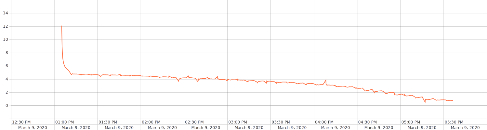
Train ap: 
[Train AP log](resnet18/v1/results/run-resnet18-tag-train_ap.csv) 

Valid loss: 
[Valid loss log](resnet18/v1/results/run-resnet18-tag-valid_loss.csv) 
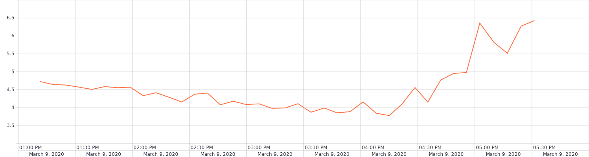
Valid ap: 
[Valid AP log](resnet18/v1/results/run-resnet18-tag-valid_ap.csv) 
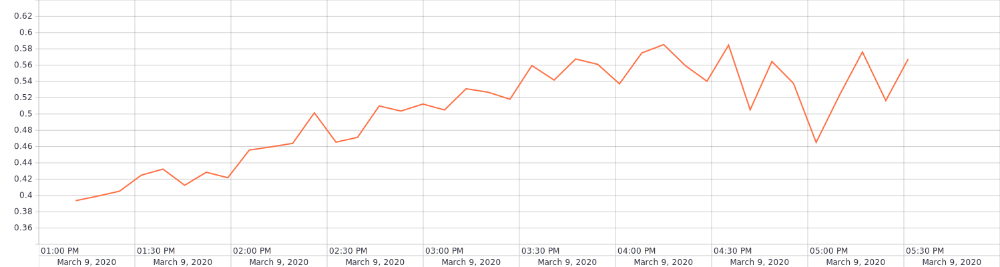

### Version 2  
Dataset with augmentation and normalization 
Images in a gray scale 
An unprepared model was used 

|    Hyperparameter   |  Values |
|:-------------------:|:-------:|
| Image Size          | 300x300 |
| Batch size          | 16      |
| Accumulate gradient | 1       |
| Epochs              | 40      |
| Optimizer           | SGD     |
| Momentum            | 0.9     |
| Learning rate       | 5e-3    |

Train loss: 
[Train loss log](resnet18/v2/results/run-resnet18_with_norm_and_augm-tag-train_loss.csv) 
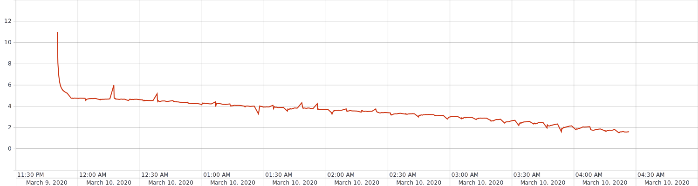
Train ap: 
[Train AP log](resnet18/v2/results/run-resnet18_with_norm_and_augm-tag-train_ap.csv) 
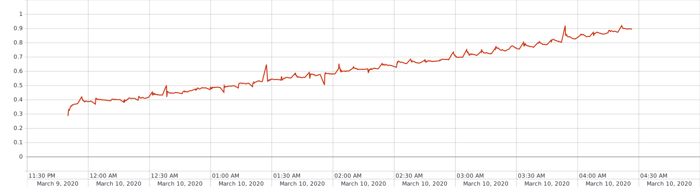
Valid loss: 
[Valid loss log](resnet18/v2/results/run-resnet18_with_norm_and_augm-tag-valid_loss.csv) 
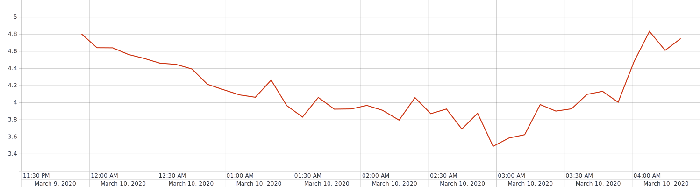
Valid ap: 
[Valid AP log](resnet18/v2/results/run-resnet18_with_norm_and_augm-tag-valid_ap.csv) 
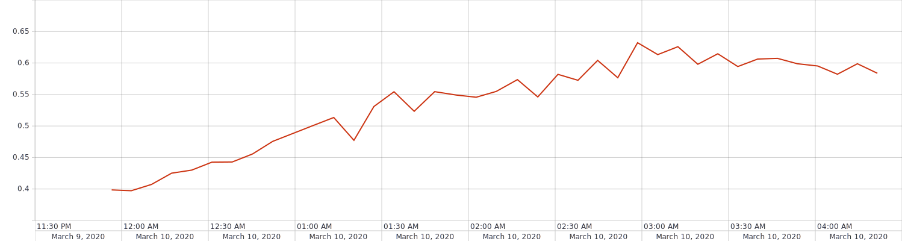

### Version 3  
Dataset with augmentation and normalization 
Images in a gray scale 
An unprepared model was used 

|    Hyperparameter   |  Values |
|:-------------------:|:-------:|
| Image Size          | 300x300 |
| Batch size          | 16      |
| Accumulate gradient | 1       |
| Epochs              | 30      |
| Optimizer           | SGD     |
| Momentum            | 0.0     |
| Learning rate       | 1e-3    |

Train loss: 
[Train loss log](resnet18/v3/results/run-resnet18_multi_label_classifier-tag-train_loss.csv) 
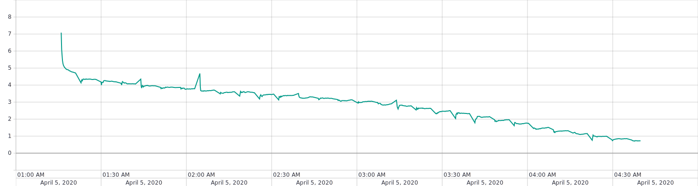
Train ap: 
[Train AP log](resnet18/v3/results/run-resnet18_multi_label_classifier-tag-train_ap.csv) 
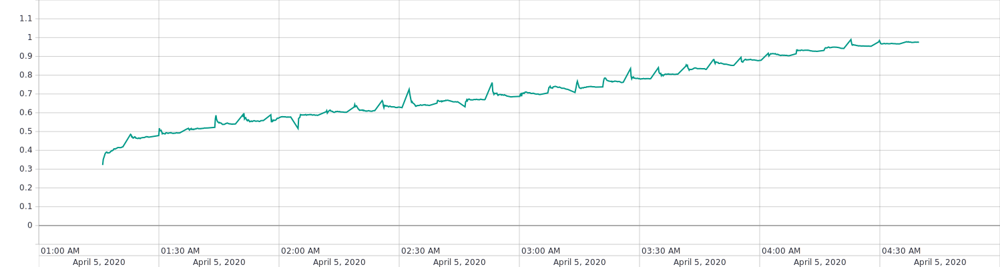
Valid loss: 
[Valid loss log](resnet18/v3/results/run-resnet18_multi_label_classifier-tag-valid_loss.csv) 
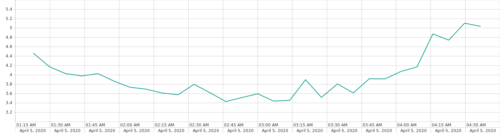
Valid ap: 
[Valid AP log](resnet18/v3/results/run-resnet18_multi_label_classifier-tag-valid_ap.csv) 
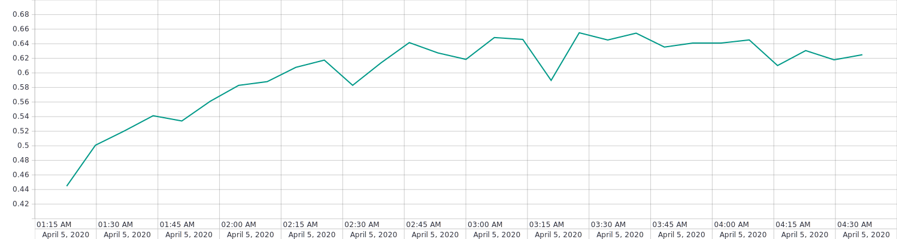
