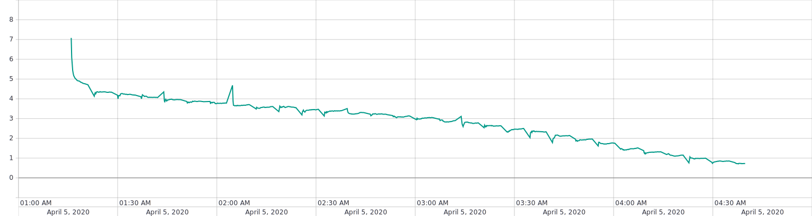
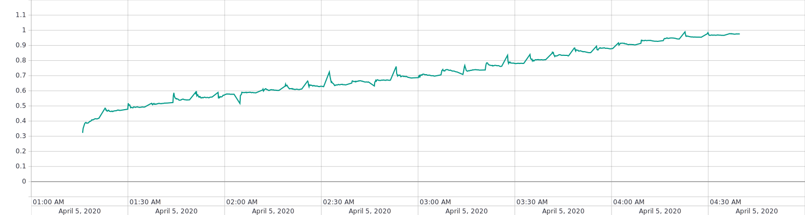
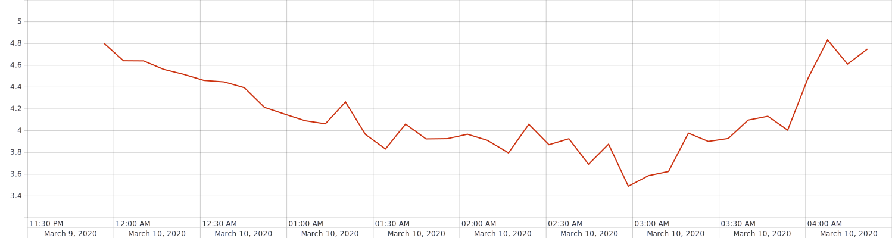
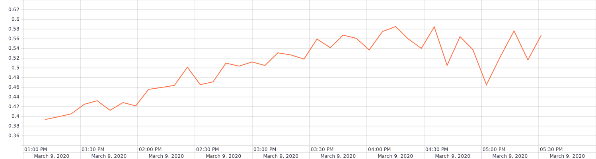

# HSE training project (VOC)

Neural Network model for multi-classification. Deep learning engine - PyTorch 

## ResNet18
### Result
|    Model version   | Loss (Train) | Average precision (Train) | Loss (Valid) | Average precision (Valid) |
|:------------------:|:------------:|:-------------------------:|:------------:|:-------------------------:|
| ResNet18 version 1 | 3.1612       | 0.6795                    | 3.4894       | 0.6322                    |

### Version 1
Dataset without augmentation and normalization 
An unprepared model was used 

|    Hyperparameter   |  Values |
|:-------------------:|:-------:|
| Image Size          | 300x300 |
| Batch size          | 16      |
| Accumulate gradient | 1       |
| Epochs              | 40      |
| Optimizer           | SGD     |
| Momentum            | 0.9     |
| Learning rate       | 5e-3    |

[TensorBoard](https://tensorboard.dev/experiment/BjPLbR4dSYOenTmRvD9Xow/)

Train loss: 
[Train loss log](results/run-resnet18_with_norm_and_augm-tag-train_loss.csv) 

Train ap: 
[Train AP log](results/run-resnet18_with_norm_and_augm-tag-train_ap.csv) 

Valid loss: 
[Valid loss log](results/run-resnet18_with_norm_and_augm-tag-valid_loss.csv) 

Valid ap: 
[Valid AP log](results/run-resnet18_with_norm_and_augm-tag-valid_ap.csv) 

